# 模式识别与机器学习报告
| 姓名   | 学号       | 班级     |
| ------ | ---------- | -------- |
| 姚翔宇 | 2021302474 | 10042101 |

</div>  

- [模式识别与机器学习报告](#模式识别与机器学习报告)
  - [任务1：多项式回归](#任务1多项式回归)
    - [1.任务描述](#1任务描述)
    - [2.数据集描述](#2数据集描述)
    - [3.任务分析](#3任务分析)
      - [普通最小二乘法](#普通最小二乘法)
    - [4.代码实现与分析](#4代码实现与分析)
      - [4.1 数据集读取与数据预处理](#41-数据集读取与数据预处理)
      - [4.2 模型训练](#42-模型训练)
      - [4.3 模型评价与预测](#43-模型评价与预测)
      - [4.4 结果可视化](#44-结果可视化)
    - [5.测试结果展示](#5测试结果展示)
      - [5.1 不同阶数下的MSE](#51-不同阶数下的mse)
      - [5.2 不同阶数下的图像曲线以及表达式](#52-不同阶数下的图像曲线以及表达式)
  - [任务2：概率分类法](#任务2概率分类法)
    - [1.任务描述](#1任务描述-1)
    - [2.数据集描述](#2数据集描述-1)
    - [3.任务分析](#3任务分析-1)
      - [数学基础](#数学基础)
        - [贝叶斯估计](#贝叶斯估计)
        - [最大似然估计](#最大似然估计)
    - [4.代码实现与分析](#4代码实现与分析-1)
      - [4.1 数据集读取与划分](#41-数据集读取与划分)
      - [4.2 定义高斯朴素贝叶斯分类器类](#42-定义高斯朴素贝叶斯分类器类)
      - [4.3 训练模型并评估](#43-训练模型并评估)
      - [4.4 测试模型并保存结果](#44-测试模型并保存结果)
    - [5.运行结果展示](#5运行结果展示)
  - [任务3：支持向量机](#任务3支持向量机)
    - [1.任务描述](#1任务描述-2)
    - [2.数据集描述](#2数据集描述-2)
    - [3.任务分析](#3任务分析-2)
      - [SVM](#svm)
    - [4.代码实现与分析](#4代码实现与分析-2)
      - [4.1 数据读取，预处理与数据集划分](#41-数据读取预处理与数据集划分)
      - [4.2 SVM实现](#42-svm实现)
      - [4.3 训练和评估模型](#43-训练和评估模型)
      - [4.4 作业结果录入](#44-作业结果录入)
    - [5.运行结果展示](#5运行结果展示-1)
  - [任务4：决策树](#任务4决策树)
    - [1.任务描述](#1任务描述-3)
    - [2.数据集描述](#2数据集描述-3)
    - [3.任务分析](#3任务分析-3)
      - [决策树](#决策树)
      - [代码思路分析](#代码思路分析)
    - [4.代码实现和分析](#4代码实现和分析)
      - [4.1 数据加载和预处理](#41-数据加载和预处理)
      - [4.2 决策树实现](#42-决策树实现)
      - [4.3 模型训练和评估](#43-模型训练和评估)
      - [4.4 作业结果录入](#44-作业结果录入-1)
    - [5.结果展示](#5结果展示)
  - [任务5：岸边垃圾识别](#任务5岸边垃圾识别)
    - [1.任务描述](#1任务描述-4)
    - [2.数据集分析](#2数据集分析)
    - [3.任务分析](#3任务分析-4)
      - [deeplabv3](#deeplabv3)
    - [4.代码实现和分析](#4代码实现和分析-1)
      - [4.1全局设置](#41全局设置)
      - [4.2 数据读取和预处理](#42-数据读取和预处理)
      - [4.3模型训练](#43模型训练)
      - [4.4 模型测试和结果可视化](#44-模型测试和结果可视化)
      - [4.5 程序总逻辑](#45-程序总逻辑)
      - [4.6 接口定义](#46-接口定义)
    - [5.结果展示](#5结果展示-1)
      - [最终模型的结果可视化](#最终模型的结果可视化)
      - [训练记录：](#训练记录)
      - [打榜记录：](#打榜记录)
      - [打榜排名](#打榜排名)
      - [模型测试记录：](#模型测试记录)
      - [测试任务](#测试任务)


---

## 任务1：多项式回归

### 1.任务描述
多项式回归是一种回归分析形式，在这种形式中，自变量 ( x ) 和因变量 ( y ) 之间的关系被建模为 ( n ) 阶多项式。使用机器学习的方法来创建一个多项式回归模型，该模型可以根据给定的数据集预测结果。数据集由自变量 ( x ) 和因变量 ( y ) 组成，你的任务是找到一个多项式，能最好地描述 ( x ) 和 ( y ) 之间的关系。

### 2.数据集描述
本实验选取数据集包含125个样本点，每个样本具有一个自变量( x )和一个因变量( y )。数据集根据4:1的比例划分为训练集和测试集。

### 3.任务分析
多项式回归是一种回归分析方式，通过多项式函数来拟合数据集，这种方法适用于数据和一个或多个非线性关系的情况。多项式回归模型的形式如下：
<div align=center>

$$
y = \beta_0+\beta_1x+\beta_2x^2+\beta_3x^3+...+\beta_nx^n+\epsilon 
$$

</div>

在多项式回归模型中，自变量的不同次方$x^2$,$x^3$,...$x^n$被作为新特征加入到模型中。通过训练数据，使用普通最小二乘法等算法来估计回归系数$\{ \beta_0,\beta_1,\beta_2...\beta_n\}$,从而捕捉数据中的非线性关系。

#### 普通最小二乘法
普通最小二乘法是估计多项式回归模型系数的常用方法，其目标是最小化实际值与预测值之间的误差平方和：
<div align=center>

$RSS = \sum_{i=1}^{m} (y_i - \hat{y}_i)^2$

m为样本数，$y_i$ 为实际值, $\hat{y}_i$为预测值。通过最小化RSS，就可以找到最佳的回归系数$\beta_0,\beta_1,\beta_2,...,\beta_n$。

</div>

### 4.代码实现与分析
#### 4.1 数据集读取与数据预处理

数据集存储在`homwework.csv`文件中，使用`numpy`库的`loadtxt`方法来读取数据。之后利用`reshape`增加一个维度以方便模型训练。

```python
import numpy as np
from sklearn.preprocessing import PolynomialFeatures
import pandas as pd

train_data = np.loadtxt(
    open("作业一/poly_reg/train_dataset.csv", "rb"), delimiter=",", skiprows=1
)
test_data = np.loadtxt(
    open("作业一/poly_reg/test_dataset.csv", "rb"), delimiter=",", skiprows=1
)
new_test_data = pd.read_csv('作业一/new_test.csv',header=0)


x_train = train_data[:, 0].reshape(-1, 1)
y_train = train_data[:, 1].reshape(-1, 1)
x_test = test_data[:, 0].reshape(-1, 1)
y_test = test_data[:, 1].reshape(-1, 1)
new_x_test=np.array(new_test_data['x'].values).reshape(-1,1)
```
接着设置多项式阶数，并采用`sklearn.preprocessing`中的`PolynomialFeatures`方法对自变量进行特征拓展。
```python
degree = 4

# 多项式特征
poly_features = PolynomialFeatures(degree=degree)
x_train_poly = poly_features.fit_transform(x_train)
x_test_poly = poly_features.transform(x_test)
new_x_test_poly=poly_features.transform(new_x_test)
```

#### 4.2 模型训练
采用`sklearn.linear_model`中的`LinearRegression`作为模型，通过模型的`fit()`方法进行训练

```python
# 模型训练
from sklearn.linear_model import LinearRegression

model = LinearRegression()
model.fit(x_train_poly, y_train)

```
#### 4.3 模型评价与预测
使用测试集对模型进行评价，并对作业数据集进行预测，通过`sklearn.metrics`中的`mean_squared_error`计算测试集的MSE，将作业数据集的预测结果直接存储回原文件
```python
from sklearn.metrics import mean_squared_error

#测试
train_predictions = model.predict(x_train_poly)
test_predictions = model.predict(x_test_poly)

#方差
train_mse= mean_squared_error(y_train,train_predictions)
test_mse = mean_squared_error(y_test,test_predictions)

print("训练集方差:",train_mse)
print("测试集方差",test_mse)

#作业提交部分
new_test_prediction=model.predict(new_x_test_poly)
#print(new_test_prediction)
new_test_data['y']=new_test_prediction
new_test_data.to_csv("作业一/homework.csv",index=False)
```

#### 4.4 结果可视化
为了能够更加直观的观察模型训练效果，采用`matplotlib.pyplot`进行图像绘制，并且通过格式化输出来输出最终的回归曲线表达式。
```python
import matplotlib.pyplot as plt

# 绘图
plt.scatter(x_train, y_train, color='blue', label='Train data')
plt.scatter(x_test, y_test, color='red', label='Test data')

# 为了绘制平滑曲线，生成许多点来预测
x_range = np.linspace(x_train.min(), x_train.max(), 500).reshape(-1, 1)
x_range_poly = poly_features.transform(x_range)
y_range_pred = model.predict(x_range_poly)

# 输出多项式表达式（仅包含非零系数的项）
coefficients = model.coef_[0]
intercept = model.intercept_[0]

# 构建多项式表达式字符串
poly_expression = f"f(x) = {intercept:.2f}"
for i in range(1, degree + 1):
    if coefficients[i] != 0:
        poly_expression += f" + {coefficients[i]:.2f}x^{i}"

print("多项式回归模型表达式：", poly_expression)

#绘图
plt.plot(x_range, y_range_pred, color='green', label=f'Polynomial Degree {degree}')
plt.title(poly_expression)
plt.xlabel('X')
plt.ylabel('Y')
plt.legend()
plt.savefig("作业一/png_homework.png")
plt.show()
```


### 5.测试结果展示
#### 5.1 不同阶数下的MSE
degree=2  

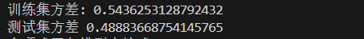  
degree=4  

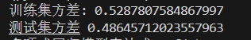  
degree=6  

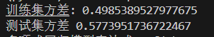  
degree=8  

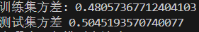  

#### 5.2 不同阶数下的图像曲线以及表达式
degree=2
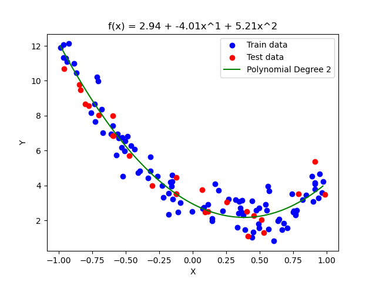
degree=4
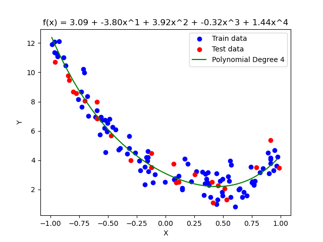
degree=6

degree=8
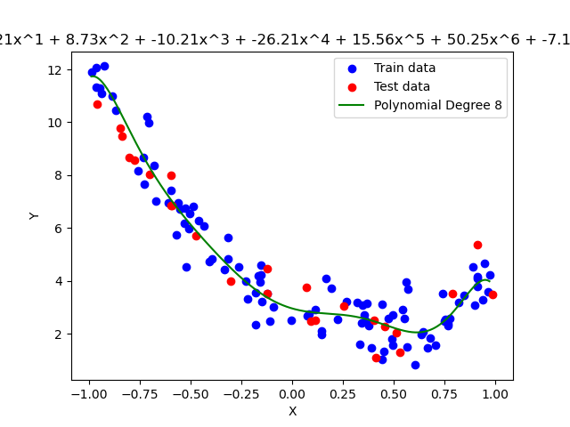

---

## 任务2：概率分类法
### 1.任务描述
使用贝叶斯估计或MLE（最大似然估计），来预测鸢尾花数据集中花的种类。
### 2.数据集描述
鸢尾花数据集是统计学和机器学习中用于分类的经典数据集。该数据集包含了三种不同的鸢尾花：Setosa、Versicolor和Virginica，每种各50个样本。每个样本有四个属性：萼片长度、萼片宽度、花瓣长度和花瓣宽度，所有的测量单位都是厘米。数据集根据4:1的比例划分为训练集和测试集。概率分类法是一种基于概率理论的方法，适合处理此类分类问题。
### 3.任务分析
贝叶斯估计和MLE是统计学中常用的两种方法，用于参数估计与分类任务。其中，贝叶斯估计利用先验知识和数据来进行参数估计，MLE则是通过最大化似然参数来估计参数。这两种方法都适用于分类问题，如本次的鸢尾花数据集分类。

在本次任务中，数据集已经提前处理好，留下了需要的特征并存储于csv文件中，只需要读取并做简单的预处理即可。之后自行实现一个高斯贝叶斯分类器，训练并评估即可
#### 数学基础
##### 贝叶斯估计
贝叶斯估计通过结合先验分布和似然函数来估计参数。贝叶斯公式如下：
<div align = center>

$P(\theta|X)=\frac{P(X|\theta)P(\theta)}{P(X)}$

</div>  

其中，$P(\theta|X)$ 是给定数据 $X$ 后参数 $\theta$ 的后验概率；$P(X|\theta)$ 是给定参数 $\theta$ 后数据 $X$ 的似然函数；$P(\theta)$ 是参数 $\theta$ 的概率；$P(X)$ 是数据X的概率
##### 最大似然估计
最大似然估计通过最大化似然函数来估计参数。似然函数表示给定参数 $\theta$ 时数据出现的概率。最大似然估计就是要找到使得似然函数最大的参数 $\theta$. 似然函数如下
<div align=center>

$ 𝐿(𝜃|𝑋)=𝑃(𝑋|𝜃)$

</div>

### 4.代码实现与分析
#### 4.1 数据集读取与划分
使用`sklearn.datasets`中的`load_iris()`加载鸢尾花数据集，将特征数据`X`和目标标签`Y`分离，并利用`sklearn.model_selection`中的`train_test_split`进行训练集和测试集的划分。

```python
from sklearn.datasets import load_iris
from sklearn.model_selection import train_test_split

iris = load_iris()
X = iris.data
Y = iris.target

# 划分数据集
x_train, x_val, y_train, y_val = train_test_split(
    X, Y, test_size=0.2, random_state=1919
)

```

#### 4.2 定义高斯朴素贝叶斯分类器类
定义一个高斯朴素贝叶斯分类器作为模型，其中`fit()`方法进行了每个类均值，方差，先验概率的计算以作为预测依据。`_calculate_likehlihood()`方法中计算了类的特征的似然，假设它符合高斯分布，`_calculate_posterior()`方法对输入数据进行后验概率的计算，并且返回概率最高的预测类。最后定义了`predict()`方法接收数据并返回预测结果。

```python
import numpy as np

class GaussianNaiveBayes:
    def fit(self, x, y):
        # 所有target
        self.classes = np.unique(y)

        # 初始化均值，方差，先验概率
        self.mean = np.zeros((len(self.classes), x.shape[1]), dtype=np.float64)
        self.var = np.zeros((len(self.classes), x.shape[1]), dtype=np.float64)
        self.priors = np.zeros(len(self.classes), dtype=np.float64)

        # 计算每个类的均值，方差和先验概率
        for idx, c in enumerate(self.classes):
            x_c = x[y == c]
            self.mean[idx, :] = x_c.mean(axis=0)
            self.var[idx, :] = x_c.var(axis=0)
            self.priors[idx] = x_c.shape[0] / float(x.shape[0])

    def _calculate_likehlihood(self, class_idx, x):
        # 计算给定类下特征的似然（假设似然服从高斯分布)
        mean = self.mean[class_idx]
        var = self.mean[class_idx]
        numerator = np.exp(-((x - mean) ** 2) / (2 * var))  # 高斯分布的分子部分
        denominator = np.sqrt(2 * np.pi * var)  # 分母部分
        return numerator / denominator

    def _calculate_posterior(self, x):
        # 计算后验概率，并返回具有最高后验概率的类
        posteriors = []
        for idx, c in enumerate(self.classes):
            piror = np.log(self.priors[idx])  # 先验概率取对数
            conditional = np.sum(
                np.log(self._calculate_likehlihood(idx, x))
            )  # 条件概率取对数并求和
            posterior = piror + conditional  # 计算后验概率
            posteriors.append(posterior)
        return self.classes[np.argmax(posteriors)]  # 返回后验概率最高的类

    def predict(self, X):
        y_pred = [self._calculate_posterior(x) for x in X]
        return np.array(y_pred)
```

#### 4.3 训练模型并评估
对自定义的高斯朴素贝叶斯分类器进行训练，并用测试集数据对其进行评估，采用`sklearn.metrics`中的`accuracy_score`方法计算评估的accuracy。

```python
from sklearn.metrics import accuracy_score

model = GaussianNaiveBayes()
model.fit(x_train,y_train)
y_pred = model.predict(x_val)
accuracy=accuracy_score(y_val,y_pred)
print(f"模型准确率:{accuracy}")

```

#### 4.4 测试模型并保存结果
用训练好的模型对作业数据进行预测，并保存预测结果到原文件中
```python
import pandas as pd

# 测试环节
test_iris = pd.read_csv("hmwk2/iris_test.csv", header=0)

test_data = np.array(test_iris[test_iris.columns[:4]].values).reshape(-1, 4)
# print(test_data)
pred_test_target = model.predict(test_data)
#print(pred_test_target)
test_iris["species"]=pred_test_target

test_iris.to_csv("hmwk2/homework.csv",index=False)
```

### 5.运行结果展示
最终评估的正确率为`0.96`，根据助教反馈信息，对作业集的正确率为`0.867`
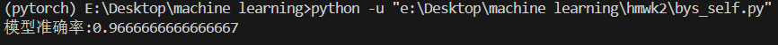

---

## 任务3：支持向量机
### 1.任务描述
基于SVM构建机器学习模型, 对Omniglot中的字符分类
### 2.数据集描述
Omniglot Dataset是全语言文字数据集，包含各种语言的不同字母表，如日语的平假名和片假名，韩语的元音和辅音，最常见的拉丁字母abcd等。Omniglot Dataset共包含50个不同语言的字母表，每个字母表中包含不同的字符，共1623种字符，每种字符由20个不同的人书写。本次实验选取其中200种字符，每种字符的15张图片作为训练集，5张图片作为测试集。
### 3.任务分析
本次任务要求使用SVM对Omniglot数据集中的字符进行分类。
#### SVM
SVM，也就是支持向量机，是一种监督学习模型，用于分类和回归分析。SVM的目标是找到一个能够最好分离不同类别的超平面。
数据中最重要的部分是支持向量，也就是距离目标超平面最近的那些数据点。这些数据对确定超平面有着决定性的作用。
SVM不仅要找到一个超平面，还要使这个超平面与支持向量的间隔最大化以提高模型的泛化能力。
当数据是线性可分的，也就是可以通过一个线性超平面完全分开，那么SVM可以直接找到一个合适的超平面。但是如果数据线性不可分，就要通过核`kernel`来解决这个问题。在本次任务中计划使用RBF核矩阵，也就是高斯核，它具有较强的灵活性和适应性，常用于非线性数据。其公式如下
<div align=center>

$K(x,x')=\exp(-\gamma\|x-x'\|^2)$

</div>

$x$和$x'$是两个样本点，$\|x-x'\|$是两个样本间的欧几里得距离，$\gamma$是用于控制核函数宽度的超参数
在本次任务中，先进行数据读取与预处理，之后自定义一个SVM，由于本次是多类分类任务，而SVM本质是一个二分类模型，因此本次准备采用“一对一”策略以使SVM可以解决多分类问题。
所谓“一对一”是指对于每两个不同的类别都训练一个SVM分类器，最终预测类别由所有的分类器投票决定。这种方式更加准确，但是计算开销比较大
### 4.代码实现与分析
#### 4.1 数据读取，预处理与数据集划分
通过`os.path`中的多个方法确定数据所在的路径以保证在不同环境下程序都可以正常读取数据。由于数据存储在mat文件中，故使用`scipy.io`中的`loadmat`方法进行数据加载。
预处理环节中，先将数据从28*28展平为长784的一维向量，之后根据数据集介绍，手动创建标签1~200，每个标签包含15个样本。最后借助`sklearn.preprocessing`中的`MinMaxScaler`方法进行数据标准化以增强模型训练效果。最后采用`sklearn.model_selection`中的`train_test_split`方法进行数据集划分。

```python
import scipy.io as sio
import numpy as np
import os
import pandas as pd
from  import train_test_split
from sklearn.preprocessing import MinMaxScaler

# 加载数据
current_dir = os.path.dirname(os.path.abspath(__file__))
train_data_path = os.path.join(current_dir, "train_data.mat")
test_data_path = os.path.join(current_dir, "test_data.mat")

train_data = sio.loadmat(train_data_path)
test_data = sio.loadmat(test_data_path)

# 将训练数据展开为 28*28 = 784 的一维向量
x_train = train_data["train"].reshape(-1, 28 * 28)
# 创建标签 1-200, 每个标签15个样本
y_train = np.repeat(np.arange(1, 201), 15)
# 将测试数据展开为 28*28 = 784 的一维向量
x_test = test_data["test"].reshape(-1, 28 * 28)

# 数据标准化
scaler = MinMaxScaler()
x_train = scaler.fit_transform(x_train)
x_test = scaler.transform(x_test)

# 划分数据集
x_train, x_val, y_train, y_val = train_test_split(
    x_train, y_train, test_size=0.25, stratify=y_train, random_state=1919
)
```
#### 4.2 SVM实现
实现一个一对一的SVM模型，核函数使用RBF。
在`rbf_kernel`方法中进行RBF核矩阵的计算。
`objective`方法计算了SVM的对偶形式，用于在训练过程中通过优化拉格朗日乘子$\alpha$以找到最优的分类决策边界，其公式为

<div align=center>

$ L(\alpha)=\sum_{i=1}^N\alpha_i-\frac{1}{2}\sum_{i=1}^N\sum_{j=1}^N\alpha_i\alpha_jy_iy_jK(x_i,x_j)$

</div>

`zerofun`方法定义了约束条件，使得拉格朗日乘子的加权和为0。`fit`方法使用二分类SVM采用一对一策略训练每对类的分类器。`predict`方法用于预测新的数据点的类别，通过投票机制确定最终分类结果
```python
from scipy.optimize import minimize
import itertools
# 实现SVM
class NonlinearSVM:
    def __init__(self, C=1.0, gamma=0.05):
        self.C = C# 正则化参数
        self.gamma = gamma# RBF核参数
        self.classifiers = {}# 存储每对类的分类器

    def rbf_kernel(self, X1, X2):#计算RBF核矩阵
        K = np.exp(-self.gamma * np.linalg.norm(X1[:, np.newaxis] - X2, axis=2) ** 2)
        return K

    def objective(self, alpha, y, K):  # SVM对偶的目标函数。
        return 0.5 * np.sum(
            alpha * alpha[:, np.newaxis] * y * y[:, np.newaxis] * K
        ) - np.sum(alpha)

    def zerofun(self, alpha, y):  # 约束条件
        return np.dot(alpha, y)

    def fit(self, X, y):
        classes = np.unique(y)
        for i, j in itertools.combinations(classes, 2):# 对每对类别训练一个分类器
            print(f"Training for classes {i} vs {j}")
            idx = np.where((y == i) | (y == j))[0]# 获取属于这两个类别的样本
            X_ij, y_ij = X[idx], y[idx]
            y_ij = np.where(y_ij == i, 1, -1)# 将标签转换为+1和-1

            K = self.rbf_kernel(X_ij, X_ij)# 计算RBF核矩阵

            N = len(y_ij)
            alpha0 = np.zeros(N)# 初始化拉格朗日乘子
            B = [(0, self.C) for _ in range(N)]# 定义alpha的边界
            constraints = {"type": "eq", "fun": lambda alpha: self.zerofun(alpha, y_ij)}# 定义约束条件
            
            # 最小化目标函数
            res = minimize(
                self.objective,
                alpha0,
                args=(y_ij, K),
                bounds=B,
                constraints=constraints,
            )
            alpha = res.x

            sv_idx = np.where(alpha > 1e-5)[0]
            b = np.mean([y_ij[k] - np.sum(alpha * y_ij * K[k]) for k in sv_idx])

            self.classifiers[(i, j)] = (alpha, b, X_ij, y_ij)

    def predict(self, X):
        votes = np.zeros((len(X), len(self.classifiers)))
        for k, ((i, j), (alpha, b, X_train, y_train)) in enumerate(
            self.classifiers.items()
        ):
            print(f"Test for classes {i} vs {j}")
            K = self.rbf_kernel(X_train, X)
            predictions = K.T @ (alpha * y_train) + b
            votes[:, k] = np.where(predictions > 0, i, j)
        y_pred = np.apply_along_axis(
            lambda x: np.bincount(x.astype(int)).argmax(), axis=1, arr=votes
        )
        return y_pred

```

#### 4.3 训练和评估模型
使用自定义的SVM模型的`fit`方法进行模型训练，并计算在测试集上的正确率
```python
from sklearn.metrics import accuracy_score

# 训练SVM模型
svm = NonlinearSVM()
print("开始训练")
svm.fit(x_train, y_train)

# 计算准确率
print("进行准确率计算")
y_val_pred = svm.predict(x_val)
accuracy = accuracy_score(y_val, y_val_pred)
print("准确率:", accuracy)

```

#### 4.4 作业结果录入
使用模型的`predict`方法对作业数据集进行预测，并将预测结果存储回原文件。
```python
# 作业部分
print("进行作业结果计算与录入")
y_test_pred = svm.predict(x_test)
hmwk_csv = pd.read_csv(os.path.join(current_dir, "submission.csv"), header=0)
hmwk_csv["预测结果"] = y_test_pred

hmwk_csv.to_csv(os.path.join(current_dir, "submission.csv"), index=False)
input()

```
### 5.运行结果展示
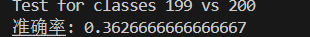

---

## 任务4：决策树
### 1.任务描述
基于决策树构建机器学习模型，根据乘客的特征预测其在 Titanic 沉船事件中是否幸存。
### 2.数据集描述
Titanic数据集中乘客的特征包含客舱等级、性别、年龄、在 Titanic 号上的同伴/配偶数量、船票编号、票价等。对于每一个乘客都包含了其是否在Titanic灾难中生还的信息（Survived），作为真实值标签。
### 3.任务分析

#### 决策树
决策树是一种监督学习算法，适用于分类和回归任务，其主要思想就是通过一系列的筛选条件，将数据集分割为更小的子集，形成一个类似于树状的结构。每个节点代表一个特征，分支为该特征的可能值，叶子节点则代表分类结果或回归值。
本次考虑建立一个简单的二叉决策树以完成任务，那么就需要找到每次分割的最佳分割点。寻找依据为信息增益，其公式如下

<div align = center>

$IG(Y,X) = H(Y)-\sum_{v\in Values(X)}P(v)·H(Y|X=v)$

</div>

$H(Y)$是分割前目标变量$Y$的熵，$Values(X)$ 是特征$X$的所有可能值.$P(v)$是特征$X$取值$v$的概率。$H(Y∣X=v)$是在特征$X$取值$v$时目标变量 $Y$的条件熵。
熵的公式如下：

<div align = center>

$H(Y)=-\sum_{i=1}^kp_i\log_2(p_i)$

</div>

之后通过方法递归建立完整的决策树。

#### 代码思路分析
本次任务需要基于决策树构建一个机器学习模型，使用Titanic数据集预测乘客在沉船事件中的生还情况。具体来说，以乘客的有效特征来预测他们是否生还，那么这里就需要对原始数据集进行数据填充并根据经验等依据筛选掉无效的特征，以提高决策树的效果。由于年龄特征为连续数据，而决策树更擅长处理离散数据，因此这里还需要将年龄数据分块，将其构造为离散数据。并将字符数据转换为数值数据以便于模型训练。
在处理完数据之后，就需要进行决策树的构建，具体需要的部件上文已经提过，这里不再赘述。
最后就是模型的训练，评估以及测试。
### 4.代码实现和分析
#### 4.1 数据加载和预处理
定义`preprocess_data`方法进行数据的读取和预处理，先通过`pandas`中的`read_csv`方法读取存储在csv文件中的数据，之后进行预处理，根据经验删除一些无关的特征，用中位数填充缺失值，并将字符特征编码为数值特征。最后对年龄进行分块，使其从连续数据变为离散数据，便于模型训练。
利用`os`的相关方法获取数据存储路径，使用定义的`preprocess_data`方法对数据进行预处理。之后分离数据特征和标签便于后续训练和评估
```python
import os
import pandas as pd
import numpy as np

# 读取和预处理数据
def preprocess_data(file_path):
    data = pd.read_csv(file_path)

    # 删除无关特征
    data.drop(columns=["PassengerId", "Name", "Ticket", "Fare", "Cabin"], inplace=True)

    # 填充缺失值
    data["Age"].fillna(data["Age"].mean(), inplace=True)
    data["Embarked"].fillna("S", inplace=True)

    # 编码分类特征
    data["Sex"] = data["Sex"].map({"male": 0, "female": 1})
    data["Embarked"] = data["Embarked"].map({"S": 0, "C": 1, "Q": 2})

    # 分箱处理连续数据Age
    # 如果年龄小于1，设为0-1岁区间；其他年龄分成多个区间
    bins = [0, 1, 12, 20, 40, 60, 80]
    labels = [0, 1, 2, 3, 4, 5]
    data["Age"] = pd.cut(data["Age"], bins=bins, labels=labels, right=False)

    return data

# 定义路径
current_dir = os.path.dirname(os.path.abspath(__file__))
train_file_path = os.path.join(current_dir, "train.csv")
test_file_path = os.path.join(current_dir, "test.csv")

# 预处理数据
train_data = preprocess_data(train_file_path)
test_data = preprocess_data(test_file_path)

# 分离特征和标签
X_train = train_data.drop(columns=["Survived"])
y_train = train_data["Survived"]
```

#### 4.2 决策树实现
实现一个简单的二叉决策树以完成这次任务，`fit`方法用于树的训练，具体的逻辑在`_grow_tree`方法中。预定义了最大深度和最小样本数作为剪枝处理，但由于后续训练效果不错没有用到。之后调用`_best_split`方法寻找最佳分割点。
在该方法中，通过计算特征值的所有阈值和其对应的类别来找出最佳分割点。具体逻辑为对其划分后左右子树的数量进行遍历，并依次通过`_information_gain`计算信息增益。信息增益最大的划分方式即为最佳分割点。
之后根据找到的最佳分割点开始子树的生长，这里是一个递归的过程。
`predict`方法用于训练结束后的预测，逻辑为根据数据进行树查找，判断该数据应该属于哪一个叶节点并给出预测结果
```python
# 决策树实现
class SimpleDecisionTree:
    def __init__(self, max_depth=5):
        self.max_depth = max_depth
        self.tree = None

    def fit(self, X, y):
        self.tree = self._grow_tree(X, y, depth=0)

    def _grow_tree(self, X, y, depth):
        num_samples, num_features = X.shape
        # 超深度或者样本数小于等于1
        if depth >= self.max_depth or num_samples <= 1:
            return np.round(np.mean(y))  # 取平均值并四舍五入

        # 寻找最佳分割点
        best_feature, best_threshold = self._best_split(X, y, num_samples, num_features)
        if best_feature is None:
            return np.round(np.mean(y))

        indices_left = X[:, best_feature] < best_threshold
        left_subtree = self._grow_tree(X[indices_left], y[indices_left], depth + 1)
        right_subtree = self._grow_tree(X[~indices_left], y[~indices_left], depth + 1)
        return (best_feature, best_threshold, left_subtree, right_subtree)

    def _best_split(self, X, y, num_samples, num_features):
        best_gain = -1
        split_idx, split_threshold = None, None
        # 计算特征值的所有可能阈值及其对应的类别
        for feature_idx in range(num_features):
            thresholds, classes = zip(
                *sorted(zip(X[:, feature_idx], y))
            )  # 对特征值和目标变量排序
            # 初始化左右子树的样本数量
            num_left = [0] * 2
            num_right = [np.sum(y == 0), np.sum(y == 1)]
            for i in range(1, num_samples):
                c = classes[i - 1]
                num_left[c] += 1
                num_right[c] -= 1
                gain = self._information_gain(
                    y, classes, num_left, num_right
                )  # 信息增益
                if thresholds[i] == thresholds[i - 1]:
                    continue
                if gain > best_gain:
                    best_gain = gain
                    split_idx = feature_idx
                    split_threshold = (thresholds[i] + thresholds[i - 1]) / 2
        return split_idx, split_threshold

    def _information_gain(self, y, classes, num_left, num_right):
        p = len(classes)
        p_left = sum(num_left) / p
        p_right = sum(num_right) / p

        if p_left == 0 or p_right == 0:
            return 0

        h = self._entropy(classes)
        h_left = self._entropy(classes[: sum(num_left)])
        h_right = self._entropy(classes[sum(num_left) :])

        return h - (p_left * h_left + p_right * h_right)

    def _entropy(self, y):
        hist = np.bincount(y)
        ps = hist / len(y)  # 各类出现概率
        return -np.sum([p * np.log2(p) for p in ps if p > 0])

    def predict(self, X):
        return [self._predict(inputs) for inputs in X]

    def _predict(self, inputs):
        node = self.tree
        while isinstance(node, tuple):
            if inputs[node[0]] < node[1]:
                node = node[2]
            else:
                node = node[3]
        return node

```
#### 4.3 模型训练和评估
调用自定义的决策树模型，并使用处理好的训练数据进行训练。训练完成后直接在训练集上进行模型评估。

```python
# 构建模型
model = SimpleDecisionTree()
model.fit(X_train.values, y_train.values)

# 在训练集上评估模型
train_predictions = model.predict(X_train.values)
accuracy = np.mean(train_predictions == y_train.values)
print(f"Train Accuracy: {accuracy:.2f}")
```
#### 4.4 作业结果录入
对作业集数据进行预测，将预测结果转为整数形式并保存到原文件中
```python
# 对测试集进行预测
test_predictions = model.predict(test_data.values)

# 将预测结果转换为整数形式
test_predictions = [int(prediction) for prediction in test_predictions]

# 保存结果到submission.csv
submission = pd.read_csv(test_file_path)[["PassengerId"]].copy()
submission["Survived"] = test_predictions
submission.to_csv(os.path.join(current_dir, "submission.csv"), index=False)
```
### 5.结果展示
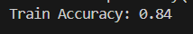
据助教反馈，测试集正确率为0.774

---

## 任务5：岸边垃圾识别
### 1.任务描述
水环境保护一直受到大家的高度关注。水体附近的垃圾不仅仅会造成消极的视觉冲击，还会继续常常造成水质问题；所以需要实时监测水体附近的的生活垃圾等，以便及时处理。项目算法要达到的目的：通过对岸边和岸上的垃圾进行分割，并按照面积阈值判断并输出报警消息
### 2.数据集分析
数据集中包含jpg和png两种格式的同名图片，其中jpg格式为图片数据，png格式为图片的mask，mask中对水体和垃圾等进行分割标注，类别有：background：背景(像素值：0),algae：水藻(像素值：1),dead_twigs_leaves：枯枝败叶(像素值：2),garbage：垃圾(像素值：3),water：水体(像素值：4)。
### 3.任务分析
本次任务属于语义分割任务，要求对岸边和岸上的垃圾进行分割，并根据面积阈值判断并输出报警信息。由于任务比较复杂，个人认为自行编写的模型可能不能胜任，因此准备采用预训练的`deeplabv3_resnet101`模型。
#### deeplabv3
该模型是Google提出的用于语义分割的深度学习模型。它通过引入多种技术，显著提高了分割精度和效率，尤其在复杂场景和多尺度对象识别中表现出色
deeplabv3的核心思想是通过空洞卷积和空间金字塔池化来提高感受野和捕获多尺度信息。在其模型架构中主要包含以下几部分：
+ 主干网络
    使用预训练的卷积神经网络作为特征提取器，作用为提取高质量的特征图以便后续处理
+ ASPP模块
    包含多个不同空洞率的卷积层，用于捕获不同尺度的特征。并结合全剧平均池化来进一步增强全局上下文信息。最后将不同尺度的特征拼接在一起，形成一个丰富的特征表示
确定使用的预训练模型后，开始构思代码框架。主体框架与其他机器学习任务类似，也就是数据读取和预处理，模型训练，模型评估和测试。但由于这次任务的复杂性，将会用到多种手段以增强训练效果。
同时由于本次项目在平台上完成，还需要编写一个`ji.py`以完成接口

### 4.代码实现和分析

#### 4.1全局设置
不知道为什么，我的`print`方法并不能在平台的实时日志中正常输出，因此添加以下设置以保证程序运行信息的有效输出。使用`logging`实现输出，并通过`os`禁用输出缓存，并重定向到标准输出流。虽不是很明白背后原理，但是这样确实保证了运行信息的正常输出。同时这一部分还包括了整个程序用到的所有第三方库

```python
import os
import sys
import torch
import numpy as np
import torch.nn as nn
import torch.optim as optim
from torchvision import models
import logging
import random
from torch.utils.tensorboard import SummaryWriter
from torch.optim.lr_scheduler import ReduceLROnPlateau
from torchmetrics import JaccardIndex
from tqdm import tqdm
from torch.cuda.amp import GradScaler,autocast
from PIL import Image
from torch.utils.data import Dataset, DataLoader
import shutil
import matplotlib.pyplot as plt
import albumentations as A
from albumentations.pytorch import ToTensorV2
logging.basicConfig(level=logging.INFO)
logger = logging.getLogger(__name__)
device = torch.device("cuda" if torch.cuda.is_available() else "cpu")
sys.stdout = os.fdopen(sys.stdout.fileno(), 'w', buffering=1)
os.environ['PYTHONUNBUFFERED'] = '1'

```
#### 4.2 数据读取和预处理
定义`SegmentationDataset`数据集类以进行数据的读取，其中由于图片数据和对应mask只有后缀不同，因此设定path时将图片路径的后缀转为png就获得了mask的路径。
数据预处理则是定义了`data_process`方法以及进行数据预处理。先读取了所有数据的目录，由于有两个数据集，因此创建一个`merged`目录先将两个数据集合并，再创建`train`和`val`目录用于训练集验证集的划分。
```python
class SegmentationDataset(Dataset):
    def __init__(self, data_dir, transform=None):

        self.data_dir = data_dir
        self.image_names = [f for f in os.listdir(data_dir) if f.endswith(".jpg")]
        self.transform = transform

    def __len__(self):
        return len(self.image_names)

    def __getitem__(self, idx):
        img_name = self.image_names[idx]
        img_path = os.path.join(self.data_dir, img_name)
        mask_path = os.path.join(self.data_dir, img_name.replace(".jpg", ".png"))

        image = Image.open(img_path)
        image = image.convert("RGB")
        mask = Image.open(mask_path).convert("L")

        image= np.array(image)
        mask = np.array(mask)

        if self.transform:
            augmented = self.transform(image=image, mask=mask)
            image = augmented["image"]
            mask = augmented["mask"]

        mask = torch.as_tensor(mask, dtype=torch.long)
        return image, mask

def data_process(dir_path):
    data_path_1 = os.path.join(dir_path, "1704")
    data_path_2 = os.path.join(dir_path, "3288")
    merged_path = os.path.join(dir_path, "merged")
    train_path = os.path.join(dir_path, "train")
    val_path = os.path.join(dir_path, "val")

    # 创建文件夹
    if not os.path.exists(merged_path):
        os.makedirs(merged_path)
    if not os.path.exists(train_path):
        os.makedirs(train_path)
    if not os.path.exists(val_path):
        os.makedirs(val_path)

    # 合并数据
    for data_path in [data_path_1, data_path_2]:
        for file_name in os.listdir(data_path):
            file_path = os.path.join(data_path, file_name)
            if file_name.endswith(".jpg") or file_name.endswith(".png"):
                dest_path = os.path.join(merged_path, file_name)
                try:
                    shutil.copy(file_path, dest_path)
                except Exception:
                    logger.info(f"Failed to copy file: {file_path}")

                # 检查文件是否成功复制，如果没有则重试
                if not os.path.exists(dest_path):
                    logger.info(f"Retry copying file: {file_path}")
                    try:
                        shutil.copy(file_path, dest_path)
                    except Exception:
                        logger.info(f"Failed to copy file on retry: {file_path}")

    # 获取merged文件夹中的所有文件名
    file_names = [f for f in os.listdir(merged_path) if f.endswith(".jpg")]

    # 计算划分比例
    train_ratio = 0.9
    num_train = int(len(file_names) * train_ratio)
    num_val = len(file_names) - num_train

    logger.info(f"Total files: {len(file_names)}, Train: {num_train}, Val: {num_val}")

    # 随机打乱文件名顺序
    random.shuffle(file_names)

    # 划分训练集和验证集
    for i, file_name in enumerate(file_names):
        img_path = os.path.join(merged_path, file_name)
        mask_name = file_name.replace(".jpg", ".png")
        mask_path = os.path.join(merged_path, mask_name)

        if os.path.exists(img_path) and os.path.exists(mask_path):
            if i < num_train:
                shutil.move(img_path, os.path.join(train_path, file_name))
                shutil.move(mask_path, os.path.join(train_path, mask_name))
            else:
                shutil.move(img_path, os.path.join(val_path, file_name))
                shutil.move(mask_path, os.path.join(val_path, mask_name))
        else:
            logger.info(f"File pair missing: {img_path}, {mask_path}")

```
数据增强用到的transform如下:
对训练集和验证集做了不同的增强，因为验证集并不需要翻转随机采样等操作以增加数据量，只需要保证数据尺寸相同，进行相同标准化即可。
```python
    train_transform = A.Compose([
        A.HorizontalFlip(p=0.5),
        A.VerticalFlip(p=0.5),
        A.RandomRotate90(p=0.5),
        A.Rotate(limit=15, p=0.5),
        A.Resize(256, 256),
        A.RandomCrop(224, 224),
        A.GaussianBlur(p=0.5),  # 添加高斯模糊
        A.RandomBrightnessContrast(p=0.5),  # 添加随机亮度对比度调整
        A.Normalize(mean=(0.485, 0.456, 0.406), std=(0.229, 0.224, 0.225), always_apply=True, p=1.0),
        ToTensorV2()
    ], additional_targets={'mask': 'mask'})
    
    val_transform = A.Compose([
        A.Resize(256, 256),
        A.CenterCrop(224, 224),
        A.Normalize(mean=(0.485, 0.456, 0.406), std=(0.229, 0.224, 0.225), always_apply=True, p=1.0),
        ToTensorV2()
    ], additional_targets={'mask': 'mask'})
    
```

#### 4.3模型训练
定义`train`方法以实现模型训练。使用`tensorboard`来记录训练中的参数变化以及绘制图表。用`tqdm`实现进度条以掌握每个epoch的训练进度。在每个epoch的训练结束后都进行一次验证，以验证集的loss为标准进行学习率的更新，同时比较该epoch训练的模型是否为效果最好的，如是则保存。每5个epoch额外保存一次模型，方便训练中断恢复。
通过`evaluate_model`方法进行验证与loss和miou的计算。miou计算借助了`JaccardIndex`类。
```python
def train(
    model,
    train_loader,
    test_loader,
    criterion,
    optimizer,
    scheduler,
    best_model_path,
    model_path,
    log_dir,
    num_epochs=5,
):
    # tensorboard记录器
    writer = SummaryWriter(log_dir=log_dir)
    scaler = GradScaler()
    best_val_loss = float("inf")
    best_epoch = -1
    best_val_miou = 0

    # 模型训练
    logger.info("begin train")
    for epoch in range(num_epochs):
        running_loss = 0.0
        model.train()
        for images, masks in tqdm(train_loader, desc=f"Epoch {epoch+1}/{num_epochs}",file=sys.stdout):
            images = images.to(device)
            masks = masks.to(device)

            optimizer.zero_grad()
            with autocast():
                outputs = model(images)["out"]
                loss = criterion(outputs, masks)

            scaler.scale(loss).backward()
            scaler.step(optimizer)
            scaler.update()

            running_loss += loss.item()

        avg_loss = running_loss / len(train_loader)
        current_lr = optimizer.param_groups[0]["lr"]  # 获取当前的学习率

        logger.info(
            f"Epoch [{epoch+1}/{num_epochs}], Loss: {avg_loss}, lr: {current_lr}"
        )
        writer.add_scalar("train_loss", avg_loss, epoch)
        writer.add_scalar("lr", current_lr, epoch)  # 记录学习率

        # 验证
        val_loss, val_miou = evaluate_model(model, test_loader, criterion)
        logger.info(f"Val Loss [{epoch+1}/{num_epochs}]: {val_loss}, mIoU: {val_miou}")
        writer.add_scalar("val_loss", val_loss, epoch)
        writer.add_scalar("miou", val_miou, epoch)

        # 更新最好的模型
        if val_loss < best_val_loss:
            best_val_loss = val_loss
            best_val_miou = val_miou
            best_epoch = epoch + 1
            torch.save(model.state_dict(), best_model_path)
            logger.info(
                f"best val_loss's epoch={best_epoch}, best_val_Loss={best_val_loss}, best_mIoU={best_val_miou}"
            )

        # 更新学习率
        scheduler.step(val_loss)
        if epoch%5==0:
            torch.save(model.state_dict(), model_path)
            logger.info(f"Epoch{epoch},save the models")
    
    writer.close()
    torch.save(model.state_dict(), model_path)
    logger.info("模型已保存")
    logger.info(
        f"best val_loss={best_val_loss}, best val_miou={best_val_miou}, bset epoch={best_epoch}"
    )
def evaluate_model(model, dataloader, criterion):
    model.eval()
    logger.info(f"val dataset's length is {len(dataloader)}")
    total_loss = 0
    total_miou = 0
    miou_metric = JaccardIndex(task="multiclass",num_classes=5, ignore_index=None).to(device)  # 定义mIoU指标

    with torch.no_grad():
        for images, masks in tqdm(dataloader, desc="Validation", leave=False,file=sys.stdout):
            images = images.to(device)
            masks = masks.to(device)
            outputs = model(images)["out"]
            loss = criterion(outputs, masks)
            total_loss += loss.item()

            # 计算miou
            preds = torch.argmax(outputs, dim=1)
            miou = miou_metric(preds, masks)
            total_miou += miou.item()
    avg_loss = total_loss / len(dataloader)
    avg_miou = total_miou / len(dataloader)

    return avg_loss, avg_miou
```
#### 4.4 模型测试和结果可视化
通过`visualize_prediction`方法进行模型测试和结果的可视化。先调用训练好的模型对测试集数据进行预测，并对预测结果进行逆归一化以方便后续可视化。可视化时通过`decode_segmap`方法进行颜色映射，将mask更加直观的展现出来。
```python
def visualize_prediction(model, test_loader, device, epoch):
    model.eval()
    with torch.no_grad():
        for images, masks in test_loader:
            images, masks = images.to(device), masks.to(device)
            outputs = model(images)['out']
            predictions = torch.argmax(outputs, dim=1)

            images = images.cpu().numpy()
            predictions = predictions.cpu().numpy()
            masks = masks.cpu().numpy()

            # 逆归一化操作
            mean = np.array([0.485, 0.456, 0.406])
            std = np.array([0.229, 0.224, 0.225])
            images = (images * std[None, :, None, None]) + mean[None, :, None, None]
            images = np.clip(images, 0, 1)  # 确保范围在 [0, 1]

            # 确保有至少3个样本进行可视化
            num_samples = min(images.shape[0], 3)
            for i in range(num_samples):
                fig, ax = plt.subplots(1, 3, figsize=(18, 6))

                ax[0].imshow(images[i].transpose(1, 2, 0))  # 原始图片
                ax[0].set_title("Original Image")
                ax[0].axis("off")

                ax[1].imshow(decode_segmap(predictions[i]))  # 预测的mask
                ax[1].set_title("Predicted Mask")
                ax[1].axis("off")

                ax[2].imshow(decode_segmap(masks[i]))  # 真实的mask
                ax[2].set_title("Ground Truth Mask")
                ax[2].axis("off")

                plt.savefig(
                    f"/project/train/result-graphs/prediction-epoch{i}.png"
                )
                plt.close(fig)  # 确保每次绘制后关闭图形

def decode_segmap(mask):
    r = np.zeros_like(mask).astype(np.uint8)
    g = np.zeros_like(mask).astype(np.uint8)
    b = np.zeros_like(mask).astype(np.uint8)

    label_colors = np.array(
        [
            (0, 0, 0),         # 背景
            (128, 0, 0),       # 水藻
            (0, 128, 0),       # 枯枝败叶
            (128, 128, 0),     # 垃圾
            (0, 0, 128)    # 水体
        ]
    )

    for label in range(0, 5):
        r[mask == label] = label_colors[label, 0]
        g[mask == label] = label_colors[label, 1]
        b[mask == label] = label_colors[label, 2]

    rgb = np.stack([r, g, b], axis=2)
    return rgb / 255.0  # 保持归一化到 [0, 1]
```
#### 4.5 程序总逻辑
在`main` 函数中进行了程序所有功能模块的串联。
```python
def main():
    batch_size = 32  # 根据显存大小调整
    num_workers = 8  # 根据 CPU 核心数调整
    num_epochs = 100 # 训练轮数

    # 数据增强
    train_transform = A.Compose([
        A.HorizontalFlip(p=0.5),
        A.VerticalFlip(p=0.5),
        A.RandomRotate90(p=0.5),
        A.Rotate(limit=15, p=0.5),
        A.Resize(256, 256),
        A.RandomCrop(224, 224),
        A.GaussianBlur(p=0.5),  # 添加高斯模糊
        A.RandomBrightnessContrast(p=0.5),  # 添加随机亮度对比度调整
        A.Normalize(mean=(0.485, 0.456, 0.406), std=(0.229, 0.224, 0.225), always_apply=True, p=1.0),
        ToTensorV2()
    ], additional_targets={'mask': 'mask'})
    
    val_transform = A.Compose([
        A.Resize(256, 256),
        A.CenterCrop(224, 224),
        A.Normalize(mean=(0.485, 0.456, 0.406), std=(0.229, 0.224, 0.225), always_apply=True, p=1.0),
        ToTensorV2()
    ], additional_targets={'mask': 'mask'})
    

    # 设置路径
    data_dir = "/home/data/"
    train_path = os.path.join(data_dir, "train")
    val_path = os.path.join(data_dir, "val")
    model_path = "/project/train/models/deeplabv3.pth"
    log_dir = "/project/train/tensorboard/"
    best_model_path = "/project/train/models/deeplabv3_best.pth"

    # 加载预训练模型
    model = models.segmentation.deeplabv3_resnet101(pretrained=True)
    model.classifier[4] = nn.Conv2d(256, 5, kernel_size=1)  # 通道数修改为5，对应类别数
    # 加载训练最好的模型
    if os.path.exists(best_model_path):
        model.load_state_dict(torch.load(best_model_path))
    model.to(device)

    # 数据预处理
    data_process(dir_path=data_dir)

    # 数据集加载
    train_dataset = SegmentationDataset(train_path, train_transform)
    test_dataset = SegmentationDataset(val_path,val_transform)  # test通常不做数据增强
    train_loader = DataLoader(
        train_dataset, batch_size=batch_size, shuffle=True, num_workers=num_workers
    )
    test_loader = DataLoader(
        test_dataset, batch_size=8, shuffle=True, num_workers=num_workers
    )

    # 损失函数，优化器和学习率调度器
    criterion = nn.CrossEntropyLoss()
    optimizer = optim.Adam(model.parameters(), lr=1e-4, weight_decay=1e-5)
    scheduler = ReduceLROnPlateau(optimizer, mode='min', factor=0.5, patience=2, verbose=True,min_lr=1e-8)

    train(
        model,
        train_loader,
        test_loader,
        criterion,
        optimizer,
        scheduler,
        best_model_path,
        model_path,
        log_dir,
        num_epochs,
    )

    model.load_state_dict(torch.load(best_model_path))
    
    # 调用预测和可视化函数
    visualize_prediction(model, test_loader, device,num_epochs+1)

```

#### 4.6 接口定义
在`ji.py`中进行了平台需要的接口定义，具体如下：
主体为平台规定格式。
```python
# ji.py
import json
import torch
import cv2
from PIL import Image
import numpy as np
from torchvision import models, transforms
import albumentations as A
from albumentations.pytorch import ToTensorV2

# 初始化模型
def init():
    model = torch.load("ev_sdk/src/model_1599.pkl",map_location=torch.device('cuda'))
    model.classifier[4] = torch.nn.Conv2d(256, 5, kernel_size=1)  # 通道数修改为5，对应类别数
    model.load_state_dict(torch.load('/project/train/models/deeplabv3.pth',map_location=torch.device('cuda')))
    model.to(torch.device('cuda'))
    model.eval()
    return model

# 处理图像
def process_image(handle=None, input_image=None, args=None, **kwargs):
    args = json.loads(args)
    mask_output_path = args.get('mask_output_path', '')

    # 图像转换
    image_transform = A.Compose([
        A.Resize(256, 256),
        A.CenterCrop(224, 224),
        A.Normalize(mean=(0.485, 0.456, 0.406), std=(0.229, 0.224, 0.225), always_apply=True, p=1.0),
        ToTensorV2()
    ])

    # 将 BGR 转换为 RGB 并应用图像转换
    input_image = cv2.cvtColor(input_image, cv2.COLOR_BGR2RGB)
    image_array = np.array(input_image)
    input_tensor = image_transform(image=image_array)['image'].unsqueeze(0).to(torch.device('cuda'))

    # 生成掩码
    with torch.no_grad():
        output = handle(input_tensor)['out'][0]
        
    output_predictions = torch.argmax(output, dim=0)
    output_predictions = output_predictions.cpu().numpy().astype(np.uint8)
    
    height, width = input_image.shape[:2]

    transforms_mask=A.Compose([
        A.Resize(height,width),
    ])
    output_predictions= transforms_mask(image=output_predictions)['image']

    if input_image.shape[:2] != output_predictions.shape:
        raise ValueError(f"Mismatch in dimensions: Input image shape {input_image.shape[:2]}, Output predictions shape {output_predictions.shape}")
    # 保存掩码
    if mask_output_path:
        output_image = Image.fromarray(output_predictions)
        output_image.save(mask_output_path)

    # 解析输出，查找目标对象
    
    objects = []
    target_info = []
    is_alert = False

    # 查找垃圾对象
    garbage_mask = (output_predictions == 3).astype(np.uint8)
    num_labels, labels, stats, centroids = cv2.connectedComponentsWithStats(garbage_mask, connectivity=8)

    for i in range(1, num_labels):
        x, y, w, h, area = stats[i]
        area_ratio = area / (width * height)

        if area_ratio > 0.02:  # 阈值为0.02
            target = {
                "x": int(x),
                "y": int(y),
                "height": int(h),
                "width": int(w),
                "name": "garbage",
                "area_ratio": float(area_ratio)
            }
            objects.append(target)
            target_info.append(target)
            is_alert = True

    result = {
        "algorithm_data": {
            "is_alert": is_alert,
            "target_count": len(target_info),
            "target_info": target_info
        },
        "model_data": {
            "objects": objects
        }
    }

    if mask_output_path:
        result["model_data"]["mask"] = mask_output_path

    return json.dumps(result, indent=4)
```

### 5.结果展示
#### 最终模型的结果可视化
  
#### 训练记录：
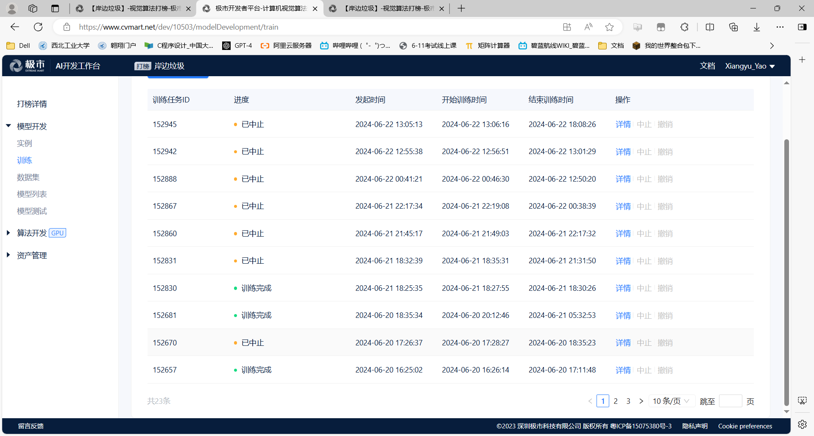  
#### 打榜记录：
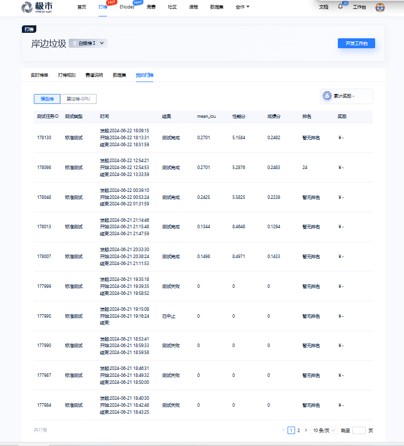  
#### 打榜排名
  
#### 模型测试记录：
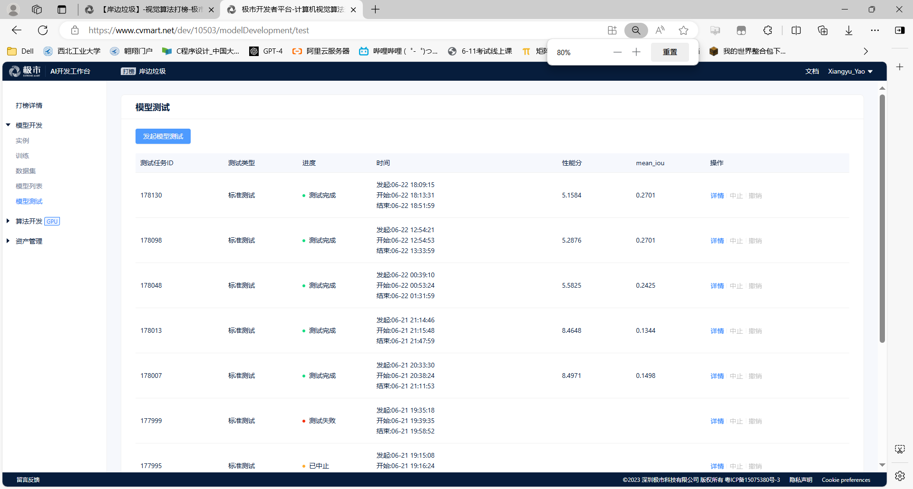  
#### 测试任务
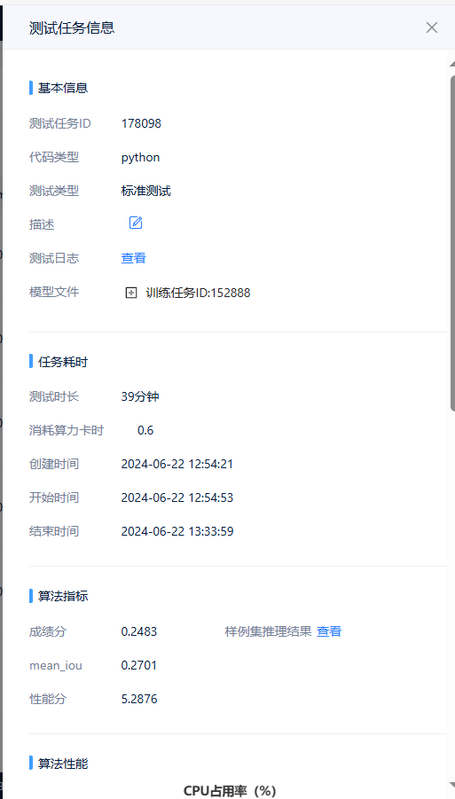  
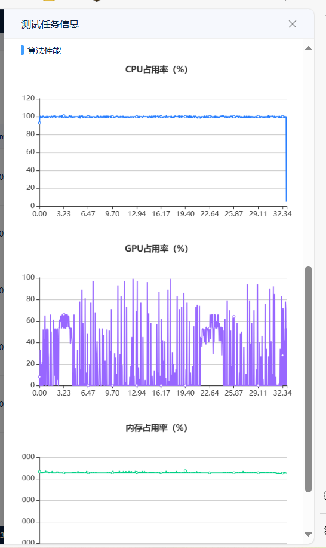  